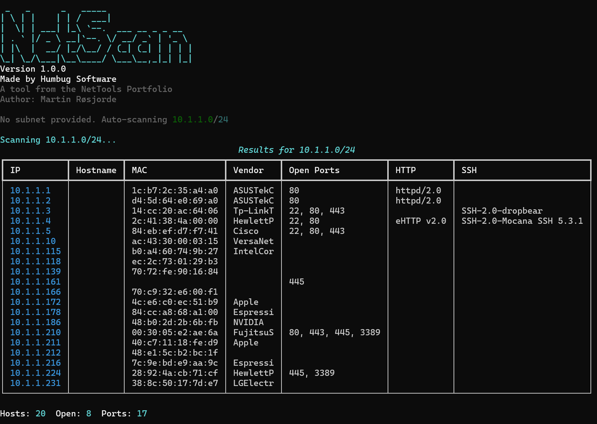

# NetScan Enterprise

NetScan Enterprise is a high-performance asynchronous network discovery
tool built for internal enterprise environments.

It combines ICMP discovery, ARP inspection, TCP scanning, banner
grabbing, and asset fingerprinting into a clean, modular framework
designed for professional network visibility.

------------------------------------------------------------------------

## 🚀 Overview

NetScan Enterprise is part of the **NetTools Portfolio** by Humbug
Software.

It is designed for:

-   Internal network discovery
-   Asset identification
-   Exposure detection
-   Rapid reconnaissance
-   Lab and infrastructure visibility

Built for Windows environments but portable to other platforms.

------------------------------------------------------------------------

## 📸 Screenshot

<p align="center">
  
</p>


## ✨ Features

-   ⚡ Asynchronous high-speed scanning
-   🌐 Multi-subnet scanning
-   📄 Subnets from file input
-   📡 ICMP sweep (host discovery)
-   🖧 ARP cache inspection (local networks)
-   🔌 TCP port scanning
-   🌍 HTTP banner & title grabbing
-   🔐 SSH banner grabbing
-   🏷 MAC address vendor lookup (OUI database)
-   🧠 Basic OS fingerprinting (heuristics)
-   📊 Rich terminal output with colored results
-   📁 JSON export
-   📄 CSV export
-   🔍 Automatic local subnet detection
-   🧩 Modular architecture (scanner / renderer / exporter separation)

------------------------------------------------------------------------

## 🧱 Architecture

    netscan/
    │
    ├── core/        # Scanning engine
    ├── cli/         # CLI interface
    ├── utils.py     # Helper functions

Designed for reuse across:

-   CLI
-   GUI
-   Future API integrations

------------------------------------------------------------------------

## 🖥 Usage

Run from project root:

``` bash
python -m cli.cli
```

If no subnet is provided, NetScan automatically scans the detected local
`/24` network.

------------------------------------------------------------------------

### Scan Single Subnet

``` bash
python -m cli.cli 10.1.1.0/24
```

------------------------------------------------------------------------

### Scan Multiple Subnets

``` bash
python -m cli.cli 10.1.1.0/24 10.2.2.0/24
```

------------------------------------------------------------------------

### Scan Subnets From File

Create `networks.txt`:

    10.1.1.0/24
    10.2.2.0/24

Then run:

``` bash
python -m cli.cli --file networks.txt
```

------------------------------------------------------------------------

### Export to JSON

``` bash
python -m cli.cli 10.1.1.0/24 --json output.json
```

------------------------------------------------------------------------

### Export to CSV

``` bash
python -m cli.cli 10.1.1.0/24 --csv output.csv
```

------------------------------------------------------------------------

## 🔎 Default Ports Scanned

By default the scanner checks:

-   22 --- SSH
-   80 --- HTTP
-   443 --- HTTPS
-   445 --- SMB
-   3389 --- RDP

These can be modified in:

    core/scanner.py

------------------------------------------------------------------------

## 📊 Output

The CLI output includes:

-   IP address
-   Hostname (reverse DNS)
-   MAC address
-   Vendor (OUI lookup)
-   OS guess (heuristic)
-   Open ports
-   HTTP server header
-   HTTP page title
-   SSH banner

Summary statistics are displayed at the end of each subnet scan.

------------------------------------------------------------------------

## ⚙ Installation

Clone repository:

``` bash
git clone https://github.com/martinarosjorde-byte/netscan
cd netscan
```

Install dependencies:

``` bash
pip install -r requirements.txt
```

------------------------------------------------------------------------

## 📦 Requirements

-   Python 3.10+
-   rich
-   manuf

------------------------------------------------------------------------

## 🪟 Build Windows Executable

To compile standalone CLI executable:

``` bash
pyinstaller --onefile -m cli.cli
```

------------------------------------------------------------------------

## ⚠ Disclaimer

NetScan Enterprise is intended for authorized internal network
environments only.

Do not scan networks without proper authorization.

------------------------------------------------------------------------

## 🏢 About

Made by Humbug Software\
Part of the NetTools Portfolio\
Author: Martin Røsjorde
